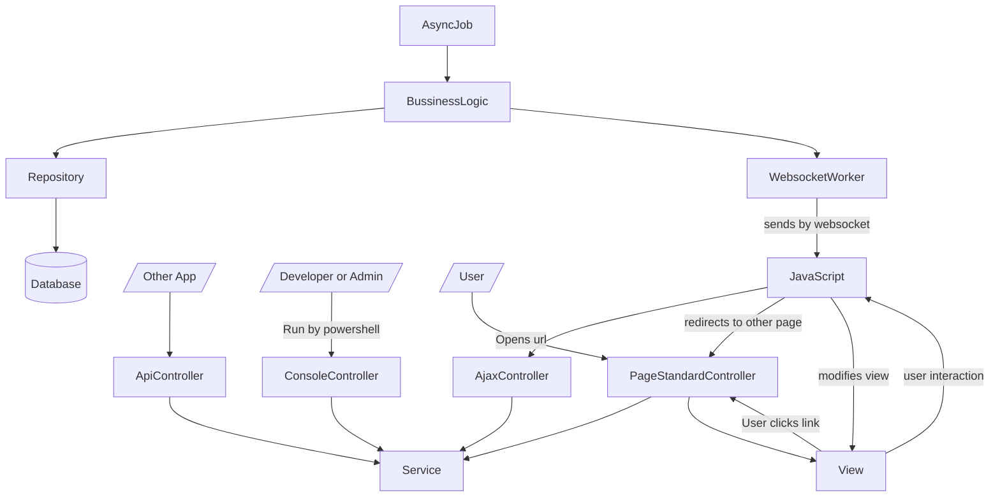

Project is based on 3 level architecture.
* Controller
* BussinessLogic
* Repository

Architecture is designed to have frontend and backend combined.

## Controller
Controller is responsible for getting requests from outside, and returning response.

There are several types of controllers

### PageStandardController
It runs when web browser opens an url, when clicks link or when user is redirected to other page.

When user opens url `https://domain.name/one/two` then will be opened `OneController` (in any module) and called function `two`. When function name is ommited, then default function is `index()`.

PageStandardController should load some views.

### AjaxController
It can also be called internal api. It allows javascript to make calls to server other, than switching to other page. What AjaxController returns in serialized to JSON.

This is not a REST api.

### Api
This is external api, meant for other apps to integrate with us.

### ConsoleControllers
Methods in console controllers become powershell commands on server or developer's computer. It is used for example to database migrations or automated code generation.

### AsyncJob
This code will be executed by schedule, without any external request. Used for example to send email on certain our, or to refresh cache.

## Service
It is responsible for bussiness logic. In case of CRUD only operations, service don't du any usefull work, but please use services even then, to keep order in code

Service shouldn't bother in anythink related to http (unless int makes requests to other app) becouse it is work of Controller, or SQL, because it is work of repository

## Repository
Reads and writes to database. We allways use MySQL, but repository should be writter in such way, that in case of changing database (even for no-SQL) only repositories should change. We will probably never change database, but this mindset helps keeping order in code.

## View
View contains html.

Views can be maid in plain php (.php files) or in MPTS (.mpts files). More info on [https://greencodestudio.github.io/mpts/](https://greencodestudio.github.io/mpts/)
